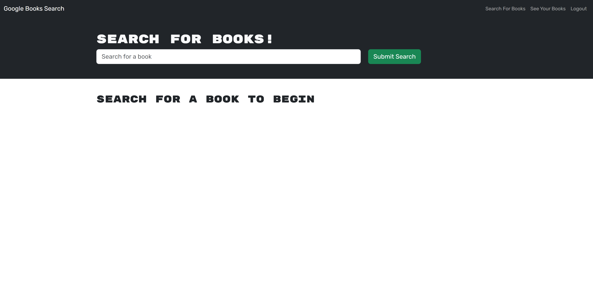

# Book Search Engine

## Description

This web application allows a user to search a database of books and add them to their account after signing up or logging in with their own account.

## Table of Contents

* [Usage](#usage)

* [License](#license)

* [Credits](#credits)

* [Questions](#questions)

## Usage

Follow [this](https://nameless-brook-56580-4b79236820f5.herokuapp.com/) link to open the application.

On opening the application, the user will see the following page:

The user can then search for books by their title, but they will be unable to add them to their account until they sign up or log in. Once they do so, they can add those books to their account and view a list of those books on their profile page.

## License

N/A

## Credits

N/A

## Questions

If you have any questions about the repo, open an issue or contact me directly at jbriseno2000@gmail.com. You can find more of my work at [jb6131](https://github.com/jb6131/).